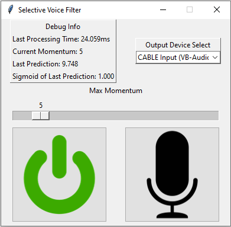

# Requirements

This program requires a virtual audio cable to work, as your mic data needs to be fed into the program and then out into a virtual cable that can be used by programs such as Discord, or Teams, etc.

I used (and recommend) [this one](https://vb-audio.com/Cable/)

## selective_voice_filter

Main file to run is read_mic.py which will launch a GUI.
Changing a .py file to a .pyw file will launch the program without a console opening if you prefer a GUI with no console. This file is already in the repo as 'read_mic_no_console.pyw'

## GUI

The GUI is quite basic and uses images I stole from the internet. 
#### Power Button / Mic Button
Pressing the power button will disable the filter and allow all audio to pass through unimpeded. 

Pressing the mic button will mute the microphone and disallow any audio from passing through.

#### Output device select
Select the virtual cable that reads your mic

#### Debug info
- **Last processing time:** The time it took to take a chunk of mic data, pass it through the neural network and output it. This tells you how delayed your voice will be heard from when you speak.
- **Current momentum:** The min/max momentum (explained below)
- **Last prediction:** The neural network's last outputted prediction
- **Sigmoid of last prediction:** The sigmoid function output of the network's output. It can be thought of as a % of correctness. Closer to 1.0 is better, and the system registers a positive as >=0.97

#### Max momentum slider
This is used to set the 'momentum' used to avoid false positives/negatives. It can be thought of as 'sensitivity.' It's likely not the best system but it's what I cobbled together as a quick strategy. The system samples at 16kHz and has a buffer of 1 second + an additional ~13ms. The neural network requires a 1 second chunk of audio to determine if you are speaking, and there is an addition ~13ms to buffer your most recent speech. Every time you talk, the past 1 second of audio is checked and the newest 13ms is added in. If the system outputs a positive, then the most recent 13ms is transmitted and the loop continues. If for some reason there is a false negative in the middle of your speech from the latest sample, then your voice will sound choppy and cut in and out.

To avoid this, momentum counts +1 for every positive reading and -1 for every negative reading up to +/- the chosen maximum. The mic will transmit as long as momentum >0. If you have a string of positive readings, then a single false negative, it will still transmit. Likewise, a single false positive amidst a string of negatives will not transmit. Setting the momentum to 0 disables this behavior and strictly relies on pos/neg neural network outputs. 

## Training

Training is done using `build_and_train_network.py` and `setup_audio_files.py`.

The idea comes from [this paper](https://ieeexplore.ieee.org/document/7162425). I went through a few iterations and this strategy seemed to be the most effective. Unfortunately I didn't spend a lot of time on optimizing this because I think it could have been better. 

Initial attempts involved looking at the FFT of a 1-second chunk of audio. My dataset, however, was too varied with too many different sampling rates and microphones and I think the inconsistency led to inconsistent results. Leveraging a CNN's ability to scan images and the short-term invariability of speech in it's frequency content, I opted to go for a graphical approach.

1 second of audio data is recorded and then resampled (likely downsampled, as most microphones have ~48kHz sample rate) to 16kHz. The reason for this is that speech frequencies rarely exist outside the 8kHz range, so accounting for the Nyquist rate, we get 16kHz. This 'zooms in' on the range of frequencies that are more dominant in speech to create a spectrogram that has less blank area.

#### `setup_audio_files.py`
This file takes all of the directories to your audio clips (each 1 second, any sample rate, all .wav files) and prepares them as spectrograms. the variable `file_len` determines the file length in seconds. In addition, it will add a random amount of white noise to each clip. `make_offset_clip` is a function that shifts each audio segment to augment the dataset. This, I think, could be vastly improved by taking the previous and next clips in the sequence and using them. As it stands, it replaces shifted sections with just blank audio.

After all the audio files are processed, you can run the main training code which will create the network model and train it on the spectrograms.
